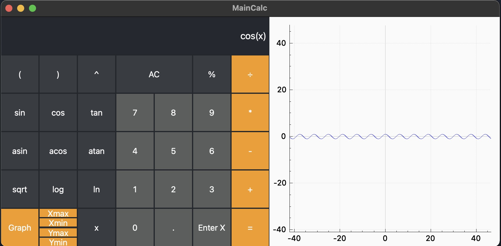

# Implementation of SmartCalc

## Table of Contents
1. [Introduction](#introduction)
2. [Goals](#goals)
3. [Build](#build)
4. [Supported Operators & Functions](#supported-operators-&-functions)

## Introduction
SmartCalc is a program designed for performing various mathematical operations, such as calculation of expressions, plotting graphs, and supporting arithmetic operations and mathematical functions.

## Goals
- Develop a comprehensive calculator program
- Learn and apply best practices in C programming
- Improve Makefile usage and workflow
- Implement GUI using appropriate libraries

## Build
The build process for SmartCalc relies on Makefile and involves the following targets: all, install, uninstall, clean, dvi, dist, test, gcov_report.

## Supported Operators & Functions

### Arithmetic Operators
| Operator Name  | Infix Notation | Prefix Notation | Postfix Notation |
|----------------|----------------|-----------------|------------------|
| Brackets       | (a + b)        | (+ a b)         | a b +            |
| Addition       | a + b          | + a b           | a b +            |
| Subtraction    | a - b          | - a b           | a b -            |
| Multiplication | a * b          | * a b           | a b *            |
| Division       | a / b          | / a b           | a b \            |
| Power          | a ^ b          | ^ a b           | a b ^            |
| Modulus        | a mod b        | mod a b         | a b mod          |
| Unary Plus     | +a             | +a              | a+               |
| Unary Minus    | -a             | -a              | a-               |

### Functions
| Function Description | Function |
|----------------------|----------|
| Compute cosine       | cos(x)   |
| Compute sine         | sin(x)   |
| Compute tangent      | tan(x)   |
| Compute arc cosine   | acos(x)  |
| Compute arc sine     | asin(x)  |
| Compute arc tangent  | atan(x)  |
| Compute square root  | sqrt(x)  |
| Compute natural logarithm | ln(x) |
| Compute common logarithm | log(x) |

## Screenshots

